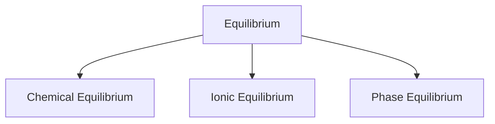

# Chemical Equilibrium

## Types of reaction

On the basic of nature 
### Irreverisble Reaction:
An irreversible reaction is a chemical reaction that proceeds in one direction only and cannot be easily reversed.  
Eg : Combustion of Hydrocarbons  
$$\ce{CH4(g) + 2O2(g) -> CO2(g) + 2H20(l)}$$

### Reversible Reaction:

