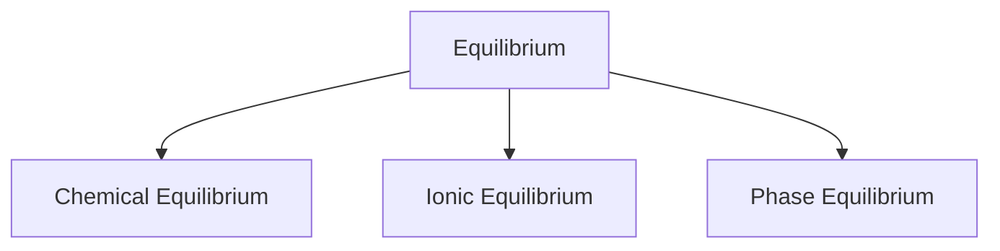
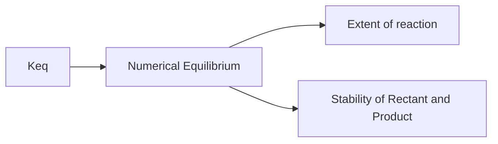

# Chemical Equilibrium 


## Types of reaction

On the basic of nature 
### Irreverisble Reaction:
An irreversible reaction is a chemical reaction that proceeds in one direction only and cannot be easily reversed.  

Eg : Combustion of Hydrocarbons 
  
$$\ce{CH4(g) + 2O2(g) -> CO2(g) + 2H20(l)}$$

### Reversible Reaction:

A reversible reaction is a chemical reaction that can proceed in both the forward and reverse directions under certain conditions. 
In other words, the reactants can convert into products, and the products can also revert back to the original reactants.   

Eg: Formation of Ammonia (Haber Process)
$$\ce{N2(g) + 3H2(g) <=> 2NH3(g)}$$

### Equilibrium State
The equilibrium state refers to a condition in a chemical reaction where the rates of the forward and reverse reactions are equal, and the concentrations of reactants and products remain relatively constant over time. At equilibrium, there is no net change in the amount of reactants and products.

#### Graphs 

1. **Irreversible**


 
1. **Reversible**  
   


### Characterstics of Equilibrium

- Dynamic in Nature
- At Equilibrium $\Delta G = 0$
- At equilibrium , their is no change in any of the measurable [Volume , mass , Pressure and MOle]
- Equilibrium cacn be achieved from both direction [FD or BD]
- There will be no effect on equilibrium after adding catalyst.

### Law of Mass Action

Acc. to this , Rate of forward reaction is directly proptionl to product of active mass of Rectant and rate of backward reaction is directyl Proptional of Active mass of Product.  

$$\ce{A + B <=> C + D }$$
$$\ce{Rectant  <=> Product}$$

Rectant :
$$r_f \propto [A][B]$$ 
$$r_f = K_f [A][B]$$   

Product:

$$r_b \propto [C][D]$$   
$$r_b = K_b [C][D]$$  

Where , $K_f$ = Rate of Forward reaction  
 $K_b$ = Rate of Backward reaction  

 **Note** : These constant change only with temperature.

At Equilibrium $\to  r_f = r_b$

$$k_f [A][B] = K_b[C][D]$$
$$ K_{eq} = \frac{K_f}{k_b} = \frac{[C][D]}{[A][B]}$$

$$\large\fbox{$K_{eq}= \frac{[C][D]}{[A][B]}$  }$$

eg: 
1. $$\ce{2A + B <=> 3C + D}$$
   $$\large k_{eq}= \frac{[C]^3[D]}{[A]^2[B]}$$
2. $$\ce{N2(g) + 3H2(g) <=>2NH3(g)}$$
   $$\large \ce{ K_{eq} = \frac{[NH3]^2}{[ N2][H2]^3}}$$


### Active Mass:

Mass which is active or mass which participate in Reaction.

   (i) **Solute in Solution:**

   Solute = Molar Concn = $\large\frac{\text{Moles}}{\text{Volume}}$ = $\large\frac{W/M}{V}$  

   (ii) **For Gases:**

   ```mermaid
   flowchart TB
   A[Gas] --> B[Molar Concn]
   A --> C[Partial Pressure ]

   
   ```

- Molar Concentration:  $\large \frac{n}{V}$ , $\large \frac{W/M}{V}$  
  
-  Partial Pressure:  P = CRT 
  
  (iii) Active Mass of Pure solid and Liquid as well as solvent in dilute solution is take as 1  

### Types of Equilibrium Constant 

- **$K_c$**  
When active mass is expressed in the term of concentration the equilibrium constant expressed as $K_c$  

  $\to$ It is defined for aqueous reaction and Gaseous reaction.  
  eg:  
  $$\ce{I2(aq) + I^-(aq) <=> I3^-(aq)}  $$
  $$K_c = \frac{[I_3^-]}{[I_2][I^-]}$$

- **$K_p$**  
  When active Mass is Expressed in the terms of pressure the equation contant expressed in $K_p$   
  $\to$ Atleast one gas in reaction  
  eg:
  $$\ce{N2(g)+ 3H2(g) <=> 2NH3(g)}$$
  $$K_p = \frac{(P_{NH_3})^2}{(P_{N_2})(P_{N_2})^3}$$

- **$K_x$**  
  When active mass is expressed interms of Mole fraction the equation constant is expressed in $K_x$

  here , X = Mole fraction and K = conatant 

  Partial Pressure = Mole fraction $\times$ Total Pressure 

  eg:
  $$\ce{A(g) <=> B(g)}$$

  $$K_x = \frac{X_A}{X_B}$$ 

### Relation Between Kp , Kc and Kx

- **Relation Between $K_p$ and $K_c$**
  
  $$\large K_p = K_c(RT)^{\Delta ng}$$   


- **Relation Between $K_p$ and $K_x$**
  $$\large K_p = K_x(P_T)^{\Delta ng}$$  

- **Relation Between $K_c$ and $K_x$**
  $$\large K_c = K_x (\frac{P_T}{RT})^{\Delta ng}$$   

### Unit of Kp and Kc

- Unit of $K_p$ =  $(atm)^{\Delta ng}$  
- Unit of $K_c$ =  $(mol/liter)^{\Delta ng}$
- Unit of $K_P^{\circ }$ = Unitless [Divide by 1 atm]
- Unit of $K_c^{\circ }$ = Unitless [Divide by 1 M]

**Question:**  
At What temperature $K_p$ and $K_c$ are Numerically same ?  
**Sol**:   12 Kelvin

### Charasterstics of Equilibrium Constant 

(i) K is applicable only when concentration of rectant and prodict have attain their equilibrium value and does not change with time.  

(ii) K is independent from initial concentration of rectant and product.  

(iii) K is independent from chnage of pressure , volume , concentration, addition of catalyst. 

(iv) A given reaction for a given stiochiometry has a unique of $K_{eq}$ at a particular temperature.  

(v) "K" chnges only and only with temperature.  
$$\Large \fbox{$\log \frac{K_{eq_2}}{K_{eq_1}} = \frac{\Delta H}{2.303 R}[\frac{1}{T_1}-\frac{1}{T_2}]$}$$

(vi) On Reversing any reaction , its $K_{eq}$ constant will inverse.  
eg:  
$$ \ce{A <=> B} ,  =>    \large K_1  $$
$$ \ce{B <=> A} ,  =>  \large K_2 $$
$$\Large \fbox{ $K_2 = \frac{1}{K_1}$}$$   

(vii) On Multiplying reaction by any number it equilibrium constant raised by power equl to that number.  
eg:  
$$ \ce{A <=> B} ,  =>    \large K_1  $$

$$ \ce{2A <=> 2B} ,  =>  \large K_2 $$
$$\Large \fbox{ $K_2 = [K_1]^2$}$$ 

(Viii) On adding reaction their equilibrium constant will be multiplied.  
eg:  
$\ce{A <=> B}$  => $K_1$   
$\ce{C <=> D}$  =>  $K_2$   
$----------$   
$\ce{A + C <=> B + D}$ =>  $K_3$   
$---------$ 

$$\Large \fbox{$K_3 = K_1 \times K_2$} $$

### Application of Equilibrium Constant 

- 1. Prediction of Directin of reaction
- 2. Prediction of Extent of reaction (0 < x < 100)  
- 3. Determination of concentration at Equilibrium.  

#### 1. Prediction of Equilibrium Constant 
   - **Reaction Quotient (Q)**  
    It helps to Predict the direction of Reaction.  
$$\ce{A + 2B <=> C + D}$$   
$$ Q = \frac{[C][D]}{[A][B]^2}$$
At any time variable can be calculate.  

Q (Quotient) => Variable  it can be calculated.  
$K_{eq}$  => Given Constant value (Maximum value): Only at equilibrium   

| Condition | Direction |  
| ---| ---|   
| Q < $K_{eq}$ | Forward Direction |
|Q > $K_{eq}$ | Backward direction | 
| Q = $K_{eq}$ | At Equilibrium |  

**Note** : When $\Delta ng$ is 0 then no need of Volume while finding concentration.  


| $K_{eq} < 10^{-3}$ | $10^{-3} < K_{eq} < 10^{3}$ | $K_{eq} > 10^{3}$ |   
| ---| ---| ---| 


  
  


