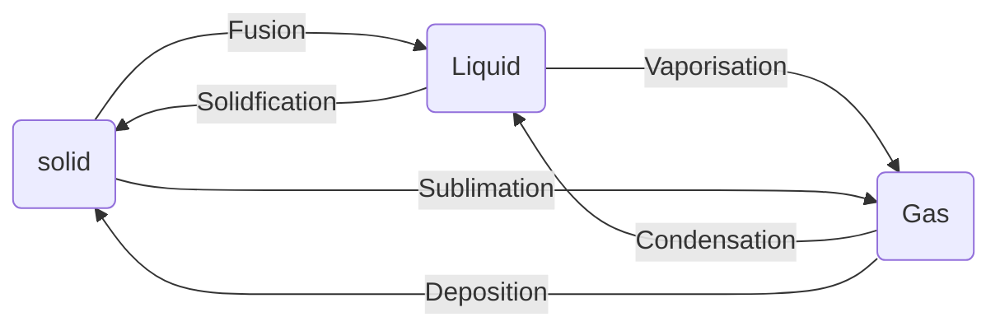

# Some Basics Concepts of Chemistry


## Importance of Chemistry

**Cisplatin** and **Taxol** are use in cancer therapy.

**AZT(Azidothymidine)** used for helping AIDS patients.

## Nature of Matter

Anything which occupies space is called matter.

eg: Books , pen , Water and Laptop etc

### States of Matter

There are 5 states of Matter 

1. **Solid**: Solid have definite volume and definite shape.
2. **Liquid**: Liquid have definite volume but do not have definite shape. They take the shape in which they are placed.
3. **Gas**: Gases have neither definite volume nor definite shape. They completely occupy the space in the container in which they are placed.
4. **Plasma:** A plasma is a state of matter in which some or all of the particles are ionized, creating a mixture of positively charged ions and negatively charged electrons. Examples include lightning, neon lights, and stars
5. **Bose-Einstein Condensate:** A Bose-Einstein Condensate (BEC) is a state of matter that occurs at extremely low temperatures, where particles are cooled to the point where they lose their individual identity and merge into a single entity. It was first predicted by Albert Einstein and Satyendra Nath Bose and later observed in 1995. It is sometimes referred to as the fifth state of matter.

- These state of matter are interconvertible by changing the Temperature and Pressure:



### Classification of matter

At the macroscopic or bulk level, matter can be classified in as ****************mixture**************** and ******************************Pure substances.******************************


- ******************Mixture:******************  A mixture contain two or more pure substances which may be present in any ratio.
    
    eg- Sugar solution in water.
    
    1. **Homogenous Mixture**: A homogeneous mixture is a mixture in which the composition is uniform throughout the mixture. This means that all the components are evenly distributed and there are no visible boundaries or separation between them.
        
        eg- Saltwater
        
    2. **********************************************Heterogenous Mixture:********************************************** A heterogeneous mixture is a type of mixture where the components are not uniformly distributed throughout the mixture, resulting in a non-uniform composition and properties throughout.
        
        eg-  salad
        
- **********************************Pure Substances:********************************** A pure substance is a type of substance that is made up of only one type of atom or molecule, and it cannot be separated into simpler substances by physical means.
    
    eg- elements
    
    1. **Elements**:  An element is a type of pure substance that is made up of only one type of atom, characterized by its unique atomic number and chemical properties.
        
        eg- Gold
        
    2. **********************Compounds:********************** A compound is a type of pure substance that is made up of two or more different elements that are chemically combined in a fixed ratio.
        
        eg-  Water 
        
    
    ### Difference Between Molecules and Compounds:
    
    | Sl. No. | Differentiating Property | Molecule | Compound |
    | --- | --- | --- | --- |
    | 1 | Definition | A molecule is a group of two or more atoms held together by chemical bonds. | A compound is a substance which is formed by two or more different types of elements which are united chemically in a fixed proportion. |
    | 2 | Relatedness | All molecules are not compounds. | All compounds are molecules. |
    | 3 | Example | An example of a molecule is ozone. | An example of a compound is table salt (sodium chloride). |
    | 4 | Structure | Molecules are simply a group of atoms which are bonded by a strong force. | All compounds are actual matter in their complete shape. |
    | 5 | Visibility | A molecule cannot be seen with the naked eye as they are at the atomic level. | A compound can be easily seen with the naked eye. |

## Properties of Matter and their Measurement

### Physical and Chemical Properties

Every substances has unique properties which can be classified into two categories

******************************************Physical Properties:****************************************** It can be measured without changing the identity or the composition of the substance.

******************************************Chemical Properties:******************************************  In this case we require a chemical change to occur.

### Measurement of Physical properties

Any quantitative measurement is represented by a number followed by units.

In earlier , two different systems of measurement.

1. English System
2. Metric system

### The International Systems of Units(SI)

The SI systems has seven base units.

| Base Physical Quantity | Symbols for Quantity | Name of SI unit | Symbol for SI unit |
| --- | --- | --- | --- |
| Length | $l$ | metre | m |
| Mass | $m$ | Kilogram | Kg |
| Time | $t$ | Second | s |
| Amount of Substances | $n$ | Mole | mol |
| Electric Current | $I$ | Ampere | A |
| Luminous Intensity | $I_v$ | Candela | cd |

### Prefixes used in SI systems

|            Multiple |                    Prefix  |                  Symbols |
| --- | --- | --- |
| $10^{-24}$ | yocto | $y$ |
| $10^{-21}$ | zepto | $z$ |
| $10^{-18}$ | atto | a |
| $10^{-15}$ | femto | f |
| $10^{-12}$ | pico | p |
| $10^{-9}$ | nano | n |
| $10^{-6}$ | micro | $\mu$ |
| $10^{-3}$ | mili | m |
| $10^{-2}$ | centi | c |
| $10^{-1}$ | deci | d |
| $10$ | deca | da |
| $10^2$ | hecto | h |
| $10^3$ | kilo | k |
| $10^6$ | mega | M |
| $10^9$ | giga | G |
| $10^{12}$ | tera | T |
| $10^{15}$ | peta | P |
| $10^{18}$ | exa | E |
| $10^{21}$ | zetta | Z |
| $10^{24}$ | yotta | Y |

### Mass and Weight

**Mass**

It is the amount of matter present in an object and is measured in units of kilograms (SI unit) or grams (cgs unit). Mass is an inherent property of an object and remains constant regardless of its location or the presence of external forces.

**Weight** 

It  is the force exerted by gravity on an object and is measured in units of Newtons (SI unit) or dynes (cgs unit). Weight is not an inherent property of an object and varies depending on the strength of the gravitational field it is placed in.

### Volume

Volume is the amount of space occupied by a substance.

Unit: $(lenght)^3$

$$
S.I= m^3
$$

but in chemistry we uses small unit like $cm^3$ or $dm^3$ 

A common unit **********Litre(L)********** is used which is not SI unit.

$$
1L = 1000mL= 1000cm^3= 1dm^3
$$

### Density

Density of substance is its amount of mass per unit volume.

It tells about how closely its particle are packed.

$$
Density= \frac{mass}{Volume}
$$

SI Unit of density is $\Large{\frac{kg}{m^3}}$  or $\Large{Kg\ m^{-3}}$

### Temperature

S.I Unit: ****************Kelvin(K)****************

$$
\degree{F} = \frac{9}{5}(\degree{C}) +32
$$

The Kelvin scale is related to ****************Celsius**************** scale as follows:

 ********************************

$$
K =\degree C + 273.15
$$

## Uncertainty in Measurement

### Scientific Notation

As chemistry is the study of atoms and molecules. which have extremely low masses and are present in extremely large numbers, a chemist has to deal with as large as 6022000000000000000 for molecule of 2g of hydrogen gas or as small as0.0000000000000000000000000166g mass of a H atom. Similarly , others constant such as Planck’s constant, speed of light, charge on particles etc involve numbers of above magnitude.

It may look funny for a moment to write or count numbers involving so many zeroes  

> The problem is solved by using scientific notation in which any number can be represented in the form of N $\times 10^n$, where n is an exponent having positive or negative values and N is a number (called digit term) which varies between 1.000... and 9.999....
> 

Example: $232.508\ as\ 2.32508\  \times 10^2$

$0.00016 = 1.6 \times 10^{-4}$

- When we moved the decimal point from left to right or right to left.


************************************Multiplication and Division************************************

$(5.6 \times 10^5) \times (6.9 \times 10^8) =(5.6 \times 6.9)(10^{5+8})$

$= 38.64 \times 10^{13} = 3.864 \times 10^{14}$

> In multiplication we add the n values.
> 

$\LARGE{\frac{2.7 \times 10^{-3}}{5.5 \times 10^{4}}}$ $= 0.4909 \times (10^{-3-4}=10^{-7})$ $= 4.909 \times 10^{-8}$

> In Division we subtract the n values
> 

**************************************************Addition  and Subtraction**************************************************

For Addition:

1. $6.65 \times 10^4 + 8.95 \times 10^3$
    
    $= 66.5 \times 10^3 + 8.95 \times 10^3$
    
    $=(66.5 + 8.95) \times 10^3$
    
    $=75.45 \times 10^3$ 
    
    $= 7.545 \times 10^4$
    

For Subtraction:

$(2.5 \times 10^{-2})-(4.8 \times 10^{-3})$

$=(2.5 \times 10^{-2})-(0.48 \times 10^{-2})$

$= (2.5 - 0.48) \times 10^{-2} = 2.02 \times 10^{-2}$

### Significant Figures

Significant figures (also known as significant digits) are a way to express the precision or certainty of a measured or calculated quantity. They indicate the number of digits that are reliable or meaningful in a given measurement or calculation.

There are certain rules for determining numbers of significant figure. These are stated below:

1. All non zero digits are significant. For example in 285 cm , there are three significant figures and in 0.25 mL, there are two significant figures.
2. Zeros preceding to first non- zero digit are not significant. Such zero indicates the position of decimal point. Thus 0.03 has one significant figure and 0.0052 has two significant figures. 
3. Zeros between two non zero digits are significant. Thus, 2.005 has four significant figures.
4. Zeros at the end or right of a number are significant , provided they are on right side of the decimal point. For ex . 0.200 g has three significant figure, But the terminal zeros are not significant figures if there is no decimal point. for ex 100 has only one significant figure, but 100. has three significant figures. Such numbers are better represented in scientific notation. We can express the number 100 as $1\times 10^2$ for one significant figure.
    
    $1.0 \times 10^2$ = Two significant figures
    
    $1.00 \times 10^2$ = Three significant figure
    
5. Counting the numbers of object, for example , 2 balls or 20 eggs, have infinite significant figures as these are exact numbers and can be represented by writing infinite numbers of zeros after placing a decimal i.e. , 2 = 2.000000000
    
    3 = 3.0000000000000
    

> In significant notation all digits are significant e.g. , $4.01 \times 10^2$ has three significant figures, and $8.256 \times 10^{-3}$ has four significant figures.
> 

Precision and accuracy are often referred  to while we talk about the measurement.

1. **Precision**: Precision refers to the level of consistency or reproducibility of a measurement or calculation. It indicates how close multiple measurements or calculations are to each other. If a measurement or calculation is precise, it means that repeated trials or calculations of the same quantity yield similar results. In other words, precision relates to the amount of variation or scatter in a set of measurements.
2. **Accuracy**: Accuracy, on the other hand, refers to how close a measured or calculated value is to the true or accepted value. It determines the correctness or trueness of a measurement or calculation. An accurate measurement or calculation indicates a minimal deviation or error between the obtained value and the true value. Accuracy relates to the absence of systematic errors or biases in the measurement or calculation process.

************************Addition and Subtraction of Significant Figures************************

- Identify the decimal place with the least number of significant figures among the numbers being added.
- Round the sum to that decimal place.
    
    For Example:
    
    12.11 + 18.0 + 1.012 
    
    here 18.0 has three significant figures and least among the above , one digit after decimal point so the result should be reported only up to one digit after the decimal point. which is 31.1.
    

********************************Multiplication and Division of Significant Figures********************************

When multiplying numbers, the result should have the same number of significant figures as the number with the fewest significant figures. Here's how you can do it:

- Identify the number with the fewest significant figures.
- Round the result to match the same number of significant figures as that number.

For example, let's multiply 2.34 and 4.567:

2.34 * 4.567 = 10.69378

Since 2.34 has three significant figures and 4.567 has four significant figures, the result should be rounded to three significant figures (matching the least number of significant figures):

10.7

Rules for the rounding off the numbers:

1. If the rightmost digit to be removed is more than 5, the preceding number is increased by one. For e.g., 1.386 if we have to remove 6, we have to to round it to 1.39.
2. If the rightmost digit to be removed is less than 5, the preceding the numbers is not changed for example , 4.334 if 4 is to be removed, then the result is rounded up to 4.33
3. If the rightmost digit to be removed is 5 then the preceding number is not changed if it is an even number, but it is increased by 1 if it is an odd number for e.g. if 6.35 is to be rounded by removing 5 we have to increase 3 to 4 giving 6.4 as the result , however if 6.25 is to be rounded off it is rounded off 6.2.

### Dimensional Analysis

Convert units from one system to other. The method used to accomplish this is called **factor label method** or **unit factor method or dimension analysis**

Example

A piece of metal is 3 inch long. What is its length in cm ?

Solution: We know that 1 in = 2.54 cm

For the equivalence 

$\large{\frac{1 in}{2.54 cm}= 1 = \frac{2.54 cm}{1 in}}$

Both of these are called ****************************unit factors.****************************  If some number is multiplied by these unit factors. It will be not affected.

$\large{3 in = 3 in \times \frac{2.54}{1in}= 3 \times 2.54cm = 7.62 cm}$

The unit factor by which multiplication is to be done is that unit factor $\large{(\frac{2.54cm}{1in})}$ , which gives the desired units i.e. , the numerator should have that part which is required in the desired result.

> It can be cancelled divided, multiplication, squared, etc
> 

```
Q.A jug contanins 2L of milk. Calculate the volume of the milk in m^3 ?
Q. How many seconds are there in 2 days ?
```

## Laws of Chemical combinations

The combination of elements to form compounds is governed by the following five basics laws:

### Law of conservation of mass

All physical and chemical changes, there is no net change in mass duting the process, and the conclusion is that matter can neither be created nor destroyed. This is called the ‘Law of conservation of mass’.

### Law of Definite Proportion

A given compound always contains exactly the same proportions of elements by weight.

Sample of cupric Carbonate - one of which is natural and other was synthetic.

|  | % of copper  | % of carbon | % of oxygen |
| --- | --- | --- | --- |
| Natural Sample | 51.35 | 9.74 | 38.91 |
| Synthetic Sample | 51.35 | 9.74 | 38.91 |

### Law of Multiple Proportions

If two elements can combine to form than one compound, the masses of one element that combine with a fixed mass of the other element, are in the ratio of small whole numbers.

For example , hydrogen combines with oxygen to form two compounds, namely water and hydrogen peroxide.

Hydrogen + Oxygen $\longrightarrow$ Water

2g                   16g               18g

Hydrogen + Oxygen $\longrightarrow$ Hydrogen Peroxide

2g                  32g                         34g

here, the masses of oxygen (16 g and 32 g), which combine with fixed mass of hydrogen (2g) bear a simple ratio i.e. , 

16:32 or 1:2

### Gay Lussac ’s Law of Gaseous Volumes

It states that under similar conditions of temperature and pressure. Whenever gases react together. the volumes of the reacting gases as well as products (if gases ) bear a simple whole number ratio.

### Avogadro’s Law

It states that equal volumes of all gases under the same conditions of temperature and pressure contain the same number of molecules.

## Dalton ‘s Atomic Theory

1. Matter consists of indivisible atoms.
2. All atoms of a given element have identical properties, including identical mass. Atoms of different elements differ in mass.
3. Compounds are formed when atoms of different elements combine in a fixed ratio.
4. Chemical reactions involve reorganisation of atoms. These are neither created nor destroyed in a chemical reaction.

## Atomic and Molecular masses

### Atomic Mass

The atomic mass or the mass of an atom is actually very-very small because atoms are extremely small. The present system of atomic masses is based on carbon-12 as the standard and has been agreed upon in 1961. Carbon-12 is one the isotopes of carbon and can be represented as $^{12}C$. In this system, $^{12}C$ is assigned a mass of exactly 12 atomic mass unit (amu) and masses of all other atoms are given relative to this standard. One atomic mass unit is defined as a mass exactly equal to one- twelfth of the mass of one carbon-12 atom.

And 1 amu = 1.66056 $\times 10^{-24}g$

Mass of an atom of hydrogen = $1.67 \times 10^{-24}g$

Thus, in terms of amu, the mass of hydrogen atom = $\large{\frac{1.6736 \times 10^{-24}g }{1.66056 \times 10^{-24}g}}$

$= 1.0078\ amu$

$= 1.0080\ amu$

Similarly, the mass of oxygen $(^{16}C)$ atoms would be 15.95amu.

**amu** has been replaced by **“u”** which is known as **Unified mass.**

When we use atomic mass of elements in calculations, we actually use average atomic masses of elements.

### Average Atomic Mass

The average atomic mass, also known as atomic weight, is the weighted average mass of the isotopes of an element.

Many elements occurring elements exist as mote than one isotope. 

| Isotopes | Relative Abundance (%) | Atomic mass in amu |
| --- | --- | --- |
| $^{12}C$ | 98.892 | 12 |
| $^{13}C$ | 1.108 | 13.00335 |
| $^{14}C$ | $2 \times 10^{-10}$ | 14.00317 |

The formula for calculating the average atomic mass is:

Average Atomic mass = ( Mass of Isotopes 1 $\times$ Abundance of Isotopes 1) + ( Mass of Isotopes 2 $\times$ Abundance of Isotopes 2)……..

The average atomic mass of carbon will come out to be:
(0.98892) (12 u) + (0.01108) (13.00335 u) + (2 ×10–12) (14.00317u) 

= 12.011 u

### Molecular Mass

Molecular mass is the sum of atomic masses of the elements present in a molecule.

Example: Molecular mass of methane

$(CH_4)$ = (12.011u) + 4(1.008 u) 

= 16.043 u

### Formula Mass

The formula, such as NaCl , is used to calculate the formula mass instead of molecular mass as in the solid state sodium chloride does not exist as a single entity.

The formula mass of Sodium Chloride is atomic mass of sodium + atomic mass of chlorine 

=23.0u + 35.5u = 58.5u

## Mole Concept and Molar masses

- In SI system,  ************mole************  (symbol, mol) was introduced as seventh base quantity for the amount of a substance.
- One mole contains exactly $6.02214076 \times 10^{23}$ elementary entities. It is called  **************************************Avogadro constant.**************************************
- $N_A$, when expressed in the unit $mol^{-1}$ and is called ********Avogadro number.********
- An elementary entity may be an atom, a molecule, an ion , an electron , any other particle or specified group of particles.

1 mol of hydrogen atoms = $6.022 \times 10^{23}$ atoms

1mol of water molecules = $6.022 \times 10^{23}$ water $(H_2O)$ molecules.

1 mol of sodium chloride = $6.022 \times 10^{23}$ formula units of sodium chloride.

<aside>
💡 The mass of one mole of a substance in grams is called **********************molar mass.**********************

</aside>

$$
Note: \text{The molar mass in grams is numerically equal to atomic/molecular/formula mass in \textbf{u}.}
$$

Molar mass of Water = $18gmol^{-1}$

Molar mass of sodium chloride = $58.5gmol^{-1}$

## Percentage Composition

$$
\text{Mass \% of an element} = \frac{\text{Mass of an element in the compound}}{\text{Molar mass of the compound}} \times 100
$$

### Empirical Formula for Molecular Formula

An empirical formula represents the simplest whole number ratio of various atoms present in a compound.

The molecular formula shows the exact number of different types of atoms present in molecule of a compound.

**************Problem:**************  A compound contains 4.07% hydrogen, 24.27% carbon 71.65% chlorine. Its molar mass is 98.96 g. What are its empirical and molecular formulas?

**************Solution:**************

**********************************************************Step 1: Conversion of mass per cent to grams**********************************************************

It is convenient to use 100g of the compound as the starting material. So, In the 100g sample of the above compound, 4.07g hydrogen, 24.27g carbon and 71.65g chlorine present.

********************Step 2: Convert into numbers moles of each element********************

The number of moles of constituent elements in the compounds

Moles of Hydrogen = $\large{\frac{4.07g}{1.008g}=4.04}$

Moles of Carbon = $\large{\frac{24.27g}{12.01g}=2.021}$

Moles of Chlorine = $\large{\frac{71.65g}{35.453g}=2.021}$

********************************************************************************************Step 3: Divide each of the mole values obtained above by the smallest number amongst them******************************************************************************************** 

2.021 is the smallest value, division by it gives a ratio 2:1:1 for H:C:Cl

In case the ratio are not whole numbers, then they may be converted into whole number by multiplying by the suitable coefficient.

**************************************************************Step 4: Write down the empirical formula by mentioning the numbers after writing the symbols of respective elements**************************************************************

$CH_2Cl$  **************************************************************************************************************************** is thus , the empirical formula for following compound

******************************************************************Step 5: Writing molecular formula******************************************************************

(a) Determine empirical formula mass by adding the atomic masses of various atoms present in the empirical formula. For $CH_2Cl$, empirical formula mass is 12.01 + (2 ×1.008) + 35.453 **= 49.48 g**

(b) Divide Molar mass by empirical formula mass

$\large{\frac{\text{Molar Mass}}{\text{Empirical formula mass}}= \frac{98.96g}{49.48g}}$ $= 2 = (n)$

(c)  Multiply empirical formula by n obtained above to get the molecular formula

Empirical formula = $CH_2Cl$, $n=2.$ Hence molecular formula is $C_2H_4Cl_2$

## Stoichiometry And Stoichiometric Calculations

The word stoichiometry is derived from two Greek words - Stoicheion (meaning element) and metrin (meaning measure).

It deals with the calculation of masses and sometimes with the volume of the reactant and the product involved in the chemical reaction. 

Lets consider the combustion of methane.

$CH_4(g) + 20_2(g) + \longrightarrow CO_2(g) + 2H_2O(g)$

The coefficient 2 for $O_2$ and $H_2O$ are called stoichiometry coefficient. Similarly coefficient for $CH_4$ and $CO_2$ is one in each case.

They represent the number of moles , molecules

Thus according to the above chemical reaction

- One mole of $CH_4$ reacts with two moles of $O_2$ to give one mole of $CO_2$ and 2 mole of $H_2O$ .
- One molecule of $CH_4$ reacts with 2 molecules of $O_2$ to give one molecules of $CO_2$ and 2 molecules of $H_2O$ .
- 22.7L of $CH_4$ reacts with 45.4 L of $O_2$ to give 22.7 of $CO_2$ and 45.4 of $H_2O$ .
- 16 g  of $CH_4$ reacts with 2 $\times$ 32g of $O_2$ to give 44g of $CO_2$ and $2 \times 18 g$ 0f $H_2O$

From these relationships, the given data can be interconverted as follows:

$\large{\frac{Mass}{Volume}  = Density}$ 

### Limiting Reagents

One reactant is in more amount than the amount required by balanced chemical reaction. The reactant which is present in the least amount consumed after sometime and after that further reaction does not take place whatever be the amount of the other reactant. Hence ****************, The reactant which gets consumed first, limits amount of product formed and is, therefore called the  limiting reagent.****************

### Reaction in solutions

The amount of substance is expresses when it is present in the solution. The concentration of a solution or the amount of substance present in its given volume can be expressed in any of the following ways.

1. Mass percent or weight percent (w/w%)
2. Mole Fraction
3. Molarity
4. Molality

1. **************************Mass per cent**************************

$$
\text{Mass percent}= \frac{Mass\ Solute}{\text{Mass of solution}} \times 100
$$

1. ********************Mole Fraction********************
    
    It a substance dissolve A dissolve in substance B and their number of moles are $n_A$ and $n_B$, respectively, then the mole fraction of A  and B are given as:
    
    
   $$ \text{Mole fraction of A}= \frac{\text{No. of moles of A}}{\text{No. of moles of solutions}}$$
    
    
    
    $$= \frac{n_A}{n_A + n_B}$$
    
    
    
    $$\text{Mole fraction of B}= \frac{\text{No. of moles of B}}{\text{No. of moles of solutions}}$$
    
    
    
   $$ = \frac{n_B}{n_A + n_B}$$
    
    
    1. ****************Molarity:**************** It is defined as the number of moles of solute in 1 litter of the solution.
    
    
    $$Molarity(M) = \frac{\text{No. of moles of solute}}{\text{Volume of solution in Liters}}$$
    
    
    Note: **Molarity** of the solution depends upon temperature because volume of a solution is temperature dependent.
    
    1. ****************Molality****************
        
        It is defines as the number of moles of solute present in 1 kg of solvent. It is denoted by ****m.****
        
        
        $$Molality(m) = \frac{\text{No. of moles of solute}}{\text{Mass of solvent in Kg}}$$
        